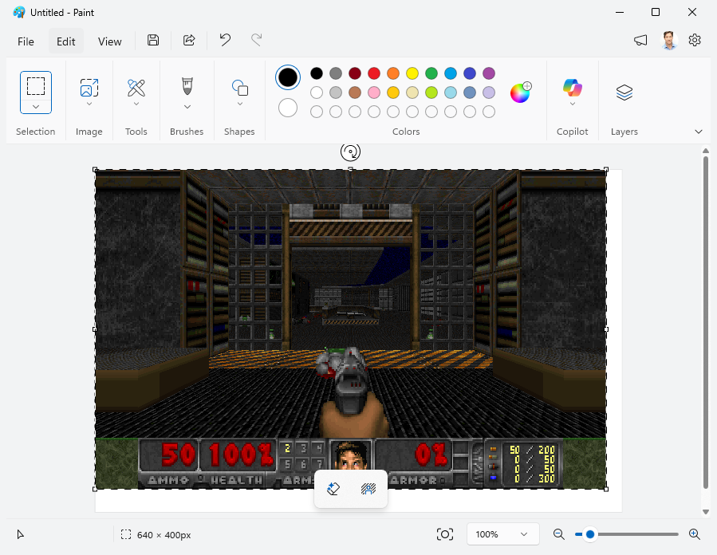

# MS Paint Doom

Real DOOM — the actual shareware `DOOM1.WAD` — playable, with **Microsoft
Paint as the monitor**.



The actual Doom engine (ViZDoom) runs the real shareware `DOOM1.WAD` — with
the BSD-licensed Freedoom WADs covering the episodes shareware doesn't ship —
and renders headlessly; every frame is placed on the Windows clipboard and
pasted into Paint's canvas as a genuine document edit. Which means:

- The spreadsheet-tier framerate (~3–10 fps) is part of the charm.
- **Ctrl+Z rewinds time.** Every frame is an undo step. You died? Un-die.
- File > Save at any moment produces a legitimate `.png` of your current frame,
  because as far as Paint knows, you painted it.

## Run

```
run.bat
```

(Creates a venv and installs dependencies on first run.) Paint opens; keep it
focused and play:

| Key | Action |
|-----|--------|
| `W` `S` / ↑ ↓ | move forward / back |
| `A` `D` / ← → | turn |
| `Q` `E` (or `,` `.`) | strafe |
| Ctrl or `F` | fire |
| Space | use / open doors |
| Shift | run |
| F12 | quit |

Fire is bound to both Ctrl and **`F`**: utilities with their own keyboard
hooks (PowerToys and friends) can eat bare Ctrl presses, so the game's hook
captures Ctrl ahead of them — and `F` remains a belt-and-suspenders
alternative for setups (remote desktop, VMs) where Ctrl never arrives at all.
Input is polled with tap-catching, so a quick fire tap still registers
despite Paint's low frame rate.

Options: `--map E1M2`, `--wad 2` (Freedoom Phase 2, maps `MAP01`+), `--scale 2`,
`--skill 1..5`, `--no-sound` (all audio off), `--no-music` (keep sound
effects, skip the soundtrack), `--music-volume 0..100` (default 40 — the
MIDI synth runs much hotter than the engine's effects), `--music-wad PATH`
(soundtrack from another WAD).

**Game data & soundtrack**: `wad\doom1.wad` — the freely-distributable
shareware episode — is both the game data and the source of the real Bobby
Prince tracks for episode 1 (vanilla WADs store music as MUS; it's converted
to MIDI on the fly). Maps shareware doesn't ship (`--map E2M1`+, `--wad 2`)
fall back to Freedoom for both game data and music. If you own the full game,
drop its `doom.wad` (or `doom2.wad`) into `wad\` for the rest of the
soundtrack, or pass `--music-wad PATH`.

If you hear nothing: the boot log prints `Audio out: <device> at <N>%` —
check that's the device you're actually listening on, and that its volume
isn't near zero. The game repairs its own per-app mixer volumes at startup
(Windows persists those forever, and a session once muted stays muted), and
if you're firing into a dead-silent engine it resets the engine's sound
system automatically (see **Sound** below).

Debugging: every session writes `last_run.log` (registered inputs,
pause/resume, engine audio peaks, self-heal events). `run_debug.bat` also
echoes registered inputs to the console live.

## How it works

1. **Engine** — ViZDoom steps the simulation N tics per rendered frame (N is
   measured from real elapsed time, so the game runs at normal speed no matter
   how slow Paint is).
2. **Display** — the frame goes to the clipboard as a DIB, then onto the
   canvas. At startup the app self-tests which paste path works:
   - **Ctrl+V** (preferred): a synthetic paste keystroke. Opens no menu, so it
     never diverts your gameplay keystrokes. Some Paint builds silently drop
     synthetic keys, hence the self-test.
   - **Edit > Paste via UI Automation** (fallback): rock-solid, but briefly
     opens the Edit menu each frame. Used only when Ctrl+V doesn't register.
     (The self-test is genuinely load-bearing: some Paint builds drop most
     synthetic Ctrl+V chords, and which path wins can vary run to run.)

   A pasted image lands as a *floating selection* that obeys arrow keys and
   pops a mini-toolbar, so each frame is immediately **committed** by switching
   to the Brushes tool via UIA — flattening it onto the canvas without drawing.
   (Best-effort: if the toolbar is hidden the button doesn't exist; frames
   then paste uncommitted rather than crashing.)

   Clipboard discipline matters at 10 fps: Paint processes each paste
   asynchronously, and rewriting the clipboard while Paint is still reading it
   pops a modal **"Can't complete operation"** error that silently kills every
   subsequent paste. Fixed timers can't close that race (paste latency varies
   wildly with frame size), so frames are published with **clipboard delayed
   rendering**: the clipboard advertises CF_DIB with a NULL handle, and when
   Paint's paste actually reads it, Windows asks us to render via
   `WM_RENDERFORMAT` — a positive signal the frame was consumed. The next
   frame is only published after that signal (or a generous timeout, which
   just means the paste keystroke was dropped). A watchdog still dismisses
   the dialog if it ever appears and demotes Ctrl+V to the menu paster if
   pastes stop landing; on exit the promise is swapped for real bytes so the
   last frame stays pasteable.
3. **Sound** — effects come from the engine itself (ViZDoom plays them through
   OpenAL on the default device; the sfx volume is pinned at launch because
   ZDoom persists cvars to `_vizdoom.ini`, and a stale zero would mute every
   later run). `run.bat` swaps ViZDoom's bundled OpenAL-Soft 1.21 for the
   1.24 build in `third_party\` — older OpenAL keeps playing to whatever
   device was default at boot, so switching to a headset mid-session used to
   strand the gunshots on the desk speakers while the music followed you;
   1.24's WASAPI backend tracks the default device automatically.

   The engine's audio init can also come up silently broken (device opens,
   renders zeros, engine never notices — nondeterministic). The game
   **self-heals**: it meters its own engine's audio session while you play,
   and firing into silence triggers ZDoom's `snd_reset` (an in-place sound
   system rebuild) within a few seconds, logged in `last_run.log`.

   Music is a different story: ViZDoom strips ZDoom's music playback
   entirely, so `music.py` pulls the map's music lump straight out of the
   game WAD (converting Doom's MUS format to MIDI when needed) and loops it
   through Windows' built-in MIDI sequencer (MCI). Alt-tab pauses the tune
   along with the game; the pause also mutes this process's audio session
   because MCI's pause freezes the sequence without releasing held notes, and
   a sustained organ chord droning over your spreadsheet is nobody's idea of
   stealth.
4. **Input** — a low-level keyboard hook (`WH_KEYBOARD_LL`) captures the game
   keys while Paint is foreground and *swallows* them, so Paint itself never
   sees them. This matters more than it sounds: Paint is the focused window
   while you play, and a stray arrow key dismisses the paste menu (stalling
   frames for many seconds — arrows literally froze the game until a
   menu-ignoring key like Ctrl advanced it), nudges the floating pasted
   selection, or navigates menus by mnemonic. Ctrl (fire) is captured too:
   utilities running their own low-level hooks (PowerToys and friends) can
   suppress bare Ctrl presses before the game polls them — our hook runs
   first and wins. Ctrl+Z time-rewind still works: a Z pressed while Ctrl is
   captured is re-injected into Paint as a clean Ctrl+Z chord. Shift is the
   only game key left pass-through. Alt-tabbing still pauses the game: keys
   are only captured while Paint is foreground. If the hook can't install,
   input falls back to plain `GetAsyncKeyState` polling (old behavior, keys
   leak into Paint). A tap latch catches keys pressed and released between
   the ~200 ms input samples.

**The commit never uses a synthetic Esc.** An earlier version committed with
Esc — but while you hold Ctrl to fire, that Esc becomes **Ctrl+Esc**, which
opens the Windows Start menu, steals focus, and freezes the game. Committing by
switching tools (a UIA button invoke, not a keystroke) avoids that chord, and
the Ctrl+V path avoids opening any menu that could eat your keys.

## Files

- `mspaintdoom/` — the app: `main.py` (loop), `engine_vzd.py` (ViZDoom
  wrapper), `paint_out.py` (Paint window mgmt, pasting, watchdogs),
  `clipserve.py` (delayed-rendering clipboard owner), `keys.py` (keyboard
  hook + polling), `music.py` (WAD music → MIDI, audio plumbing),
  `sendinput.py`, `capture.py`
- `wad\doom1.wad` — shareware DOOM (game data + episode 1 soundtrack)
- `third_party\OpenAL32.dll` — OpenAL-Soft 1.24 (installed over ViZDoom's by
  `run.bat`)
- `run_debug.bat` — run with live input echo (`MSPAINTDOOM_DEBUG=1`)
- `last_run.log` — written every session: inputs, pauses, audio self-heal
- `smoke_test.py` — engine renders headlessly, no Paint involved
- `test_quiet.py` — clipboard→paste→capture round-trip without touching focus
- `cap_now.py <out.png>` — snapshot the Paint window (works while occluded)
- `PLAN.md` — original build plan

## Honest asterisks

- The engine is ViZDoom (ZDoom-based). Game data for episode 1 is the real
  **shareware `DOOM1.WAD`** (freely distributable, in `wad\`); maps beyond
  episode 1 (`--map E2M1`+ or `--wad 2`) fall back to Freedoom, since
  shareware only ships E1. A commercial `doom.wad`/`doom2.wad` dropped into
  `wad\` supplies the soundtrack for those maps; wiring one up as full game
  data is a one-liner (`DoomEngine(game_wad=...)` accepts any IWAD).
- ViZDoom boots straight into the map — no title screen, no attract demos,
  no in-game menus. The shareware WAD is real; the arcade shell around it
  isn't.
- Paint renders the game but does not compute it. Paint computes nothing.
  Paint has never computed anything. That's the joke.

## License

MIT (see `LICENSE`). Third-party bits keep their own terms: OpenAL-Soft
(`third_party\`, LGPL v2 — license included), the DOOM shareware WAD
(id Software's shareware terms: freely redistributable, not open source),
and Freedoom (BSD, bundled with the `vizdoom` package).
